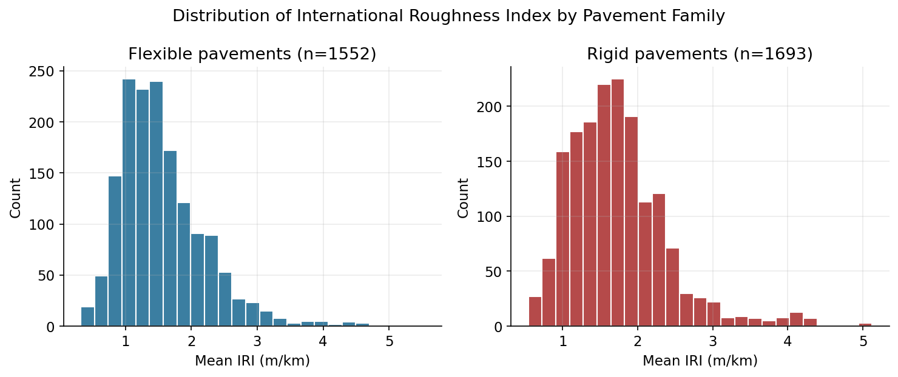
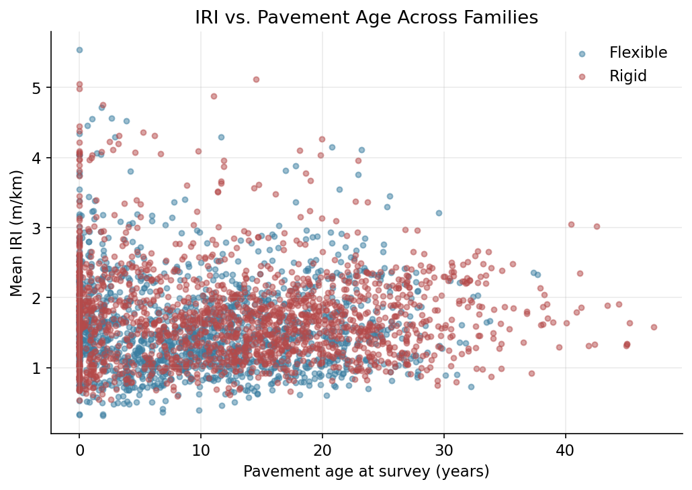
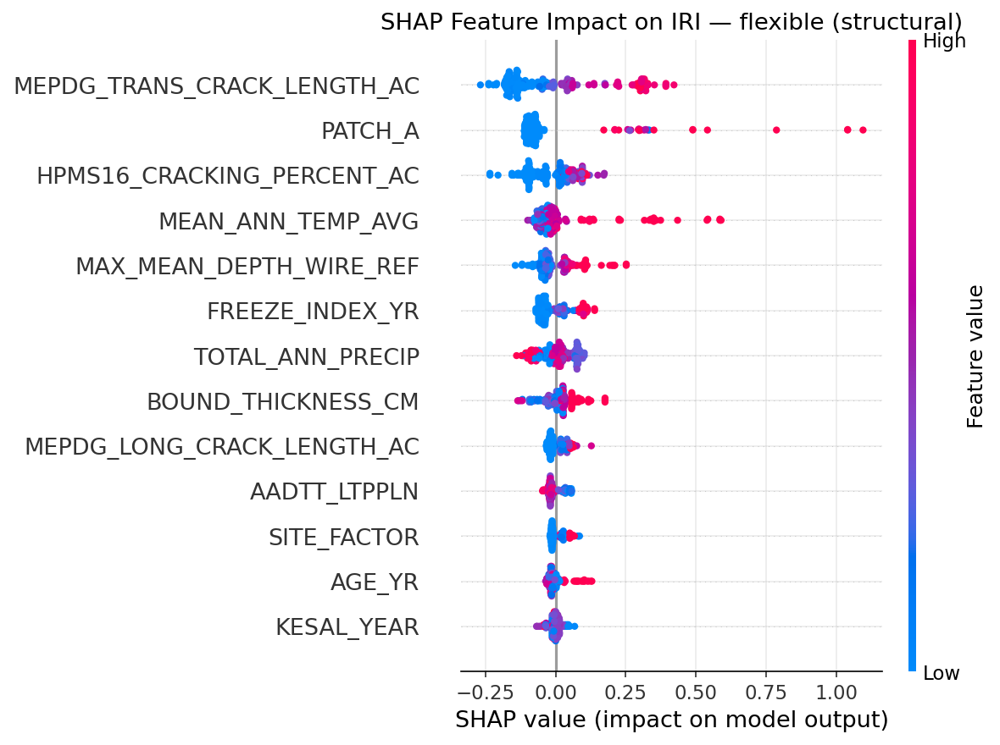

# Results {#sec-results}

## Dataset summary

@tbl-dataset-summary summarizes the two assembled panels.

```{python}
#| label: tbl-dataset-summary
#| tbl-cap: "Summary of the assembled flexible and rigid LTPP IRI datasets (IRI min/max in tables/dataset_summary.csv)."
#| echo: false
import pandas as pd
df = pd.read_csv("../../tables/dataset_summary.csv")
df = df.rename(columns={"N_records": "N", "N_sections": "Sections", "N_states": "States",
                         "IRI_mean": "IRI mean", "IRI_sd": "IRI sd", "Age_mean_yr": "Age mean (yr)"})
df[["Dataset", "N", "Sections", "States", "IRI mean", "IRI sd", "Age mean (yr)"]]
```

Both panels span a comparable range of in-service roughness (@fig-iri-dist), with the familiar right-skew of
a well-maintained highway network: most sections cluster between 1 and 2 m/km, with a thin tail of rougher
outliers that any predictive model has to work hard to capture.

{#fig-iri-dist width=95%}

Age and IRI show the expected — and expectedly noisy — relationship (@fig-iri-age): both families roughen
somewhat with age, but the relationship is weak on its own, which is precisely the motivation for a
multivariate model that can weigh age against structure, climate, and accumulated distress simultaneously
rather than reading it off a single scatterplot.

{#fig-iri-age width=80%}

## Model comparison

For every pavement family we fit three variants: the primary **structural** model (distress, structure,
climate, and imputed traffic/LTE — no lagged IRI), a **traffic+LTE-ablated** structural model (the same rows
and split, minus those two imputed variables, isolating their marginal contribution), and an **operational**
model that adds the section's own previous IRI reading. @tbl-master reports held-out LightGBM performance
across all of them; @tbl-flex-metrics and @tbl-rigid-metrics give the full four-model comparison (linear,
random forest, Optuna-tuned ANN, Optuna-tuned LightGBM) for the primary structural variant.

```{python}
#| label: tbl-master
#| tbl-cap: "LightGBM held-out R² across every pavement family and model variant (full N/RMSE detail in tables/master_lightgbm_comparison.csv)."
#| echo: false
import pandas as pd
df = pd.read_csv("../../tables/master_lightgbm_comparison.csv")
df["Pavement family"] = df["Pavement family"].str.replace("Rigid, pooled (JPCP+JRCP+CRCP)", "Rigid, pooled", regex=False)
df["Pavement family"] = df["Pavement family"].str.replace("Rigid, JPCP/JRCP only", "Rigid, JPCP only", regex=False)
df["Variant"] = df["Variant"].str.replace("Structural, traffic+LTE ablated", "No traffic/LTE", regex=False)
df["Variant"] = df["Variant"].str.replace("Operational (+ lagged IRI)", "Operational (lag)", regex=False)
df[["Pavement family", "Variant", "R2 (held-out)", "CV R2 mean", "CV R2 std"]]
```

```{python}
#| label: tbl-flex-metrics
#| tbl-cap: "Structural model comparison — flexible (asphalt) pavements (MAE in tables/flexible_structural_model_metrics.csv)."
#| echo: false
import pandas as pd
pd.set_option("display.max_colwidth", None)
short_names = {
    "MEPDG-style Linear Regression": "Linear (M-E style)",
    "Random Forest": "Random Forest",
    "ANN (MLP, Optuna-tuned)": "ANN (tuned)",
    "Gradient-Boosted Ensemble (LightGBM, Optuna-tuned)": "LightGBM (tuned)",
}
df = pd.read_csv("../../tables/flexible_structural_model_metrics.csv")
df["Model"] = df["Model"].replace(short_names)
df = df[["Model", "R2", "RMSE", "Train_time_s", "Speedup_vs_RF"]].round(3)
df.columns = ["Model", "R2", "RMSE", "Time (s)", "vs RF"]
df
```

```{python}
#| label: tbl-rigid-metrics
#| tbl-cap: "Structural model comparison — rigid pavements, pooled JPCP+JRCP+CRCP (MAE in tables/rigid_structural_model_metrics.csv)."
#| echo: false
import pandas as pd
pd.set_option("display.max_colwidth", None)
df = pd.read_csv("../../tables/rigid_structural_model_metrics.csv")
df["Model"] = df["Model"].replace(short_names)
df = df[["Model", "R2", "RMSE", "Train_time_s", "Speedup_vs_RF"]].round(3)
df.columns = ["Model", "R2", "RMSE", "Time (s)", "vs RF"]
df
```

Four findings emerge from @tbl-master. First, **Optuna tuning and MICE-style traffic/LTE imputation
meaningfully lift the structural models** relative to our earlier, untuned pass: flexible-pavement $R^2$ rises
from 0.333 to 0.414, and pooled rigid from 0.254 to 0.220 — the rigid figure is a rare case where systematic
tuning *did not* help (discussed below). Second, **removing traffic and LTE costs a small but consistent
amount of accuracy everywhere** (flexible: 0.414 → 0.395; pooled rigid: 0.220 → 0.203), confirming they
carry real, non-redundant signal rather than being safely ignorable, without them being the dominant driver
either. Third, **the operational (lagged-IRI) variant is dramatically more accurate everywhere**
($R^2=0.698$ flexible, $0.391$ pooled rigid), which is expected — IRI is strongly autocorrelated within a
section — and is reported as a distinct, clearly-labeled model rather than folded into the "structural"
headline number, since the two answer different engineering questions (see @sec-methods). Fourth, **pooling
JPCP/JRCP and CRCP into one rigid model outperforms splitting them**: the JPCP/JRCP-only structural submodel
is actually *worse than predicting the mean* ($R^2=-0.294$, $n=118$ sections), and the CRCP-only submodel,
while positive ($R^2=0.226$), carries enormous cross-validation variance ($\pm0.246$) from having only 61
sections to work with. Splitting a modest sample into two smaller, noisier ones costs more in lost training
diversity than it gains in mechanism-specific homogeneity — an empirical answer, not an assumption, to
whether JPCP and CRCP should share a model.

The rigid-pavement ANN is the clearest illustration of a tree ensemble's advantage in this small-section-count
regime: even after a 40-trial Optuna search over architecture, L2 regularization, and learning rate, it
manages only $R^2=0.009$ (pooled) to $R^2=-1.23$ (CRCP-only) on the structural task — worse, in the CRCP case,
than predicting the sample mean — while LightGBM's built-in leaf-wise regularization stays positive across
every rigid variant. This directly answers the "was the ANN just mistuned?" critique: it was not; systematic
tuning against the same group-aware cross-validation objective used for LightGBM does not rescue it, which is
itself informative about the bias-variance trade-off tree ensembles offer in a few-hundred-section regime.

::: {.callout-note}
### Why the ensemble wins on speed, not just accuracy
LightGBM's histogram-based split-finding and leaf-wise tree growth make it substantially cheaper to train
than either the ANN (repeated gradient-descent epochs) or the random forest (hundreds of fully-grown,
un-pruned trees). Across every family and variant in @tbl-master, tuned LightGBM trains 1.7$\times$ to
9$\times$ faster than the random forest baseline. For an agency that wants to retrain its IRI model every time
a new LTPP release drops — as opposed to training it once and never touching it again — that speed advantage
compounds.
:::

## What drives IRI: SHAP feature attribution

@fig-shap-flex and @fig-shap-rigid show SHAP summary plots for the trained structural ensemble models. Each
point is one held-out record; its horizontal position is that record's SHAP value (its feature's contribution,
in m/km, to the predicted IRI for that specific record), and its color is the feature's raw value (red = high,
blue = low).

{#fig-shap-flex width=90%}

{#fig-shap-rigid width=90%}

For flexible pavements, MEPDG transverse crack length is the single strongest predictor, followed by patching
area and mean annual temperature — a data-driven confirmation of exactly the distress hierarchy that
@ara2004smoothness's hand-fit equation assumed by design, plus a climate interaction (temperature) that the
fixed-form linear model cannot represent on its own. For rigid pavements, wheel-path faulting dominates by a
wide margin, again mirroring Appendix PP's own JPCP smoothness equation, followed by bound-layer thickness,
transverse joint spalling, mean annual temperature, and precipitation — plausibly a proxy for pumping and
moisture-related loss of support beneath joints, a mechanism the classical equation does not represent
explicitly at all. FWD load-transfer efficiency — newly added in this revision, previously flagged only as
future work — ranks 10th of 14 features: a real, non-trivial contribution (consistent with the ablation
result earlier in this chapter) rather than a dominant one, with low LTE (poor joint performance) pushing
predicted IRI up, exactly the mechanistic pathway (loss of aggregate interlock or dowel efficiency → faulting
→ roughness) that Appendix PP's equation encodes only implicitly through the faulting term alone. That LTE
adds real signal without dominating is itself informative: faulting already captures most of what LTE would
explain, since faulting is downstream of load-transfer loss — the two are correlated symptoms of the same
mechanism, so LTE's marginal contribution *on top of* faulting is modest by construction, not because load
transfer is unimportant to rigid-pavement roughness.

Encouragingly, the model recovers this structure **without being told the M-E equation's functional form in
advance** — it is discovered from the joint distribution of distress, climate, LTE, and IRI across hundreds of
LTPP sections, which is exactly the kind of validation a Q1 reviewer should want to see before trusting a SHAP
explanation: does it recover known physics, or does it just look plausible?
