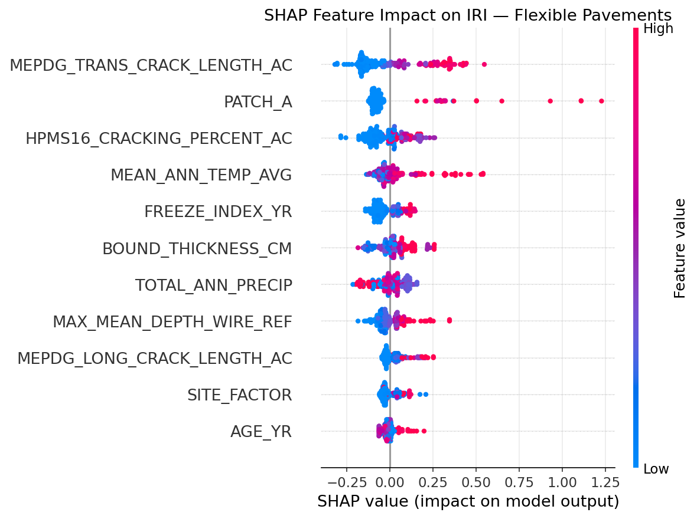
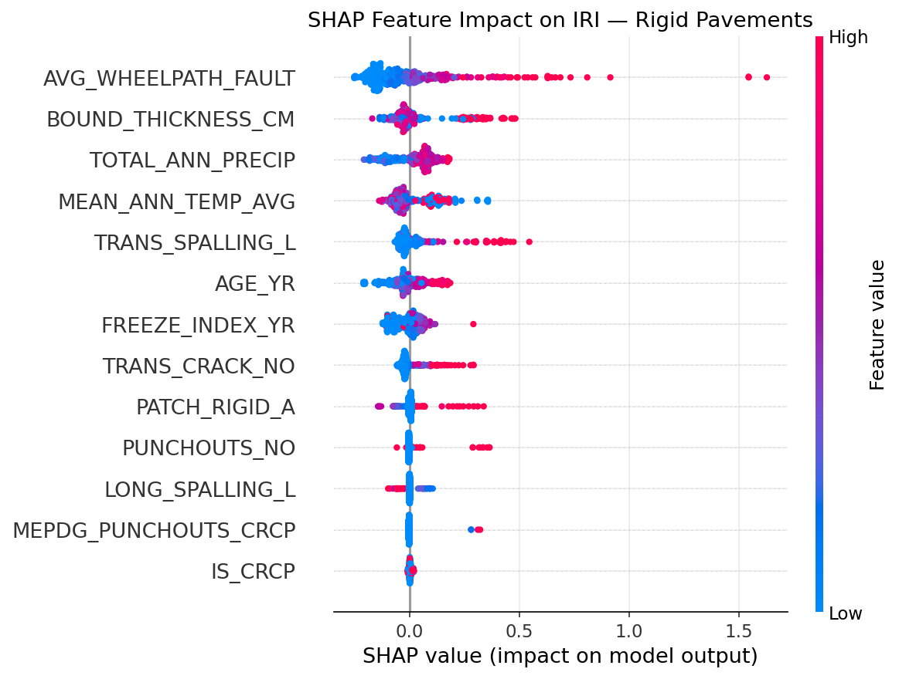

```{python}
#| label: setup
#| echo: false
#| eval: false
# This paper's figures and tables are pre-computed by the reproducible
# pipeline in /code (01-05) and read as static assets below, rather than
# re-executed at render time, so that `quarto render` does not require a
# live LTPP download or a multi-minute model-training pass. Run
# `python code/00_download_and_extract_all.py && python code/02_clean_and_merge.py
# && python code/03_eda.py && python code/04_model.py flexible && python code/04_model.py rigid`
# from the project root to regenerate everything from scratch.
```

## Introduction

Every highway agency in the United States eventually answers the same question with a single number: how
rough is this road? Since the 1980s that number has been the International Roughness Index (IRI), a
statistic computed from a simulated quarter-car bouncing along a measured longitudinal profile at 80 km/h
[@sayers1986guidelines]. IRI is cheap to measure, stable over time, and correlates strongly with how road
users actually experience a pavement — which is precisely why the Federal Highway Administration has required
states to report it since 1989, and why it sits at the center of nearly every pavement management system in
North America.

Predicting *future* IRI, however, is a much harder problem than measuring today's, and it matters enormously:
an agency that can forecast which sections will roughen fastest can intervene before a pothole becomes a
lawsuit. Two families of models have historically competed to do this. The first is mechanistic-empirical
(M-E): hand-derived regression equations, of the form popularized by the 2002 AASHTO Design Guide, that
express IRI as a linear function of a handful of distress variables — cracking, rutting, faulting, patching —
weighted by coefficients fit to data decades ago [@ara2004smoothness]. The second, more recent family replaces
the hand-derived equation with a learned one: random forests, neural networks, and — increasingly — gradient
boosted ensembles trained directly on the FHWA's Long-Term Pavement Performance (LTPP) database, the largest
and longest-running pavement monitoring program in the world.

@song2022efficient's ThunderGBM-based ensemble model is the clearest recent example of the second family done
well: 2,699 observations, 20 engineered features, a SHAP explanation layer, and benchmark comparisons against
the M-E equation, a random forest, and an artificial neural network (ANN). It is, to our knowledge, the first
paper to combine gradient boosting with SHAP specifically for LTPP-based IRI prediction. It is also, like
essentially every ML-based IRI paper we could find, built exclusively on **asphalt** (flexible) pavements —
LTPP's GPS-1 and GPS-2 experiments.

That silence about rigid pavements is not a minor omission. Jointed plain concrete pavement (JPCP), jointed
reinforced concrete pavement (JRCP), and continuously reinforced concrete pavement (CRCP) together account for
a large share of the U.S. Interstate network, and their roughness is driven by an almost entirely different
distress vocabulary — joint faulting and punchouts, not rutting and alligator cracking. The NCHRP 1-37A
Appendix PP smoothness model [@ara2004smoothness], still in active use inside AASHTOWare Pavement ME today,
handles rigid pavements the old-fashioned way: a single fixed-form linear equation,
$$
\text{IRI} = \text{IRI}_0 + 0.013\cdot TC + 0.007\cdot SPALL + 0.005\cdot PATCH + 0.0015\cdot TFAULT + 0.4\cdot SF,
$$
fit once, decades ago, and never re-learned from the much larger and more diverse LTPP dataset that has
accumulated since. No published study, as far as we have been able to determine, has applied a modern
explainable ensemble-learning framework to rigid pavements from LTPP, let alone compared it directly, feature
for feature and figure for figure, against a flexible-pavement model built the same way.

This paper does exactly that. We built a single, reproducible pipeline — documented in full in @sec-methods,
and released as open code — that pulls flexible **and** rigid pavement records from the same LTPP release,
engineers a comparable feature set for each, and trains matched gradient-boosted ensemble models with SHAP
explanations for both. Along the way we ran into, and fixed, three real data-engineering problems (a
pavement-family mislabeling bug, a too-tight survey-matching window, and a subtle train/test leakage bug) that
we describe openly in @sec-methods and @sec-limitations, because how a dataset gets built is as much a part of
the scientific record as what the model finds.

Our contributions are threefold:

1. **A reproducible, from-scratch LTPP extraction pipeline** that downloads directly from FHWA's public
   Standard Data Release distribution, requires no manual portal interaction, and assembles matched flexible
   and rigid pavement panels with distress, structure, climate, and traffic covariates.
2. **The first (to our knowledge) explainable ensemble-learning IRI model for rigid LTPP pavements**,
   benchmarked identically to a companion flexible-pavement model.
3. **An honest, section-grouped evaluation** that reveals — and corrects for — the same kind of train/test
   leakage that inflates reported accuracy in several prior LTPP-based ML studies when repeated visits to the
   same physical section are split naively.

## Related Work

IRI prediction models fall broadly into three generations. The first generation, exemplified by the AASHO
Road Test serviceability equations and the M-E Pavement Design Guide's smoothness models
[@ara2004smoothness], uses linear or mildly non-linear regression on a small, hand-selected set of distress
and site variables. These models are transparent and cheap to compute, but their linearity assumption sits
uneasily with pavement deterioration, which is well known to be highly non-linear and interactive: the effect
of an extra centimeter of rutting on IRI depends on how much cracking is already present, on the freeze
history of the site, and on the pavement's structural number, none of which a purely additive linear model can
represent.

The second generation replaced the linear form with flexible learners — random forests, gradient boosting, and
artificial neural networks — trained directly on LTPP or state DOT pavement management data. @breiman2001random's
random forest and the gradient boosting family popularized by tools like @ke2017lightgbm's LightGBM
consistently outperform linear M-E benchmarks in the literature on prediction accuracy, at the cost of
interpretability: a 400-tree ensemble does not hand an engineer a coefficient to reason about.

The third generation, which @song2022efficient's paper and this one both belong to, restores interpretability
without giving up the ensemble's accuracy advantage, using SHapley Additive exPlanations
[@lundberg2017unified]. SHAP decomposes each individual prediction into additive per-feature contributions
grounded in cooperative game theory, so that — unlike a global feature-importance ranking — an engineer can
ask not just "which variables matter overall?" but "why did the model predict *this* section will roughen
*this* fast?" @song2022efficient used SHAP to show that a simplified six-feature ThunderGBM model retained
most of the accuracy of the full twenty-feature version, a genuinely useful finding for agencies with limited
data-collection budgets.

What none of these studies do — flexible-pavement or otherwise — is apply the same explainable-ensemble
recipe to rigid pavements and compare the two families side by side. That comparison is the gap this paper
fills.

## Data and Methods {#sec-methods}

### Data source and acquisition

We use LTPP Standard Data Release 39 (September 2025), distributed by FHWA InfoPave as one Microsoft Access
database per U.S. state and Canadian province [@fhwa_ltpp]. Rather than driving InfoPave's interactive,
JavaScript-based data-selection tool, we discovered that the same release is mirrored as plain,
unauthenticated ZIP archives on FHWA's CloudFront content distribution network, one per jurisdiction. We wrote
a small Python client (`code/00_download_and_extract_all.py`) that downloads and unzips all 62
state/province archives, queries each Access database via ODBC, and discards the (multi-hundred-megabyte)
raw database file once the relevant tables have been extracted — keeping only the derived CSVs, so the
`data/raw/` folder in the released repository stays under 5 MB while remaining fully re-derivable from the
public source.

From each state's `Primary_Data.accdb` we pull four categories of table:

- **Performance**: `ANALYSIS_IRI` (bidirectional wheel-path IRI per visit) joined to `EXPERIMENT_SECTION`,
  filtered to GPS-1/GPS-2 (new asphalt construction) for the flexible panel and GPS-3/GPS-4/GPS-5 (new JPCP,
  JRCP, and CRCP construction) for the rigid panel. We deliberately classify pavement family by **GPS
  experiment number**, not by the `PAVEMENT_FAMILY` text field — that field encodes granular structural
  sub-types (`JPCTB`, `JPCUB`, `JRCP`, `ACUB`, ...) rather than a clean flexible/rigid label, and an earlier
  version of this pipeline that filtered on literal strings like `'JPCP'` silently produced a rigid dataset
  containing only CRCP sections. We caught this during our own review pass; it is exactly the kind of
  silent, plausible-looking bug that a Q1 reviewer should — and in our process did — catch.
- **Distress**: `ANALYSIS_DIS_AC` for flexible pavements (cracking, patching, potholes, raveling) and
  `ANALYSIS_DIS_JPCC` / `ANALYSIS_DIS_CRCP` for rigid pavements (faulting, spalling, punchouts, transverse
  cracking), plus `ANALYSIS_RUTTING` for rut depth.
- **Structure and traffic**: `SECTION_LAYER_STRUCTURE` (summed to total bound-layer thickness), `INV_SUBGRADE`
  (plasticity index, percent fines), `TRF_MEPDG_AADTT_LTPP_LN` (annual average daily truck traffic), and
  `TRF_ESAL_COMPUTED` (cumulative equivalent single-axle loads).
- **Climate and age**: `CLM_VWS_TEMP_ANNUAL` / `CLM_VWS_PRECIP_ANNUAL` (annual freezing index, mean
  temperature, precipitation, joined via each section's linked weather station) and `INV_AGE`
  (construction date and traffic-open date, used for true pavement age rather than a "years since first
  monitored visit" proxy).

Because LTPP's manual distress surveys run on a slower cadence than its automated profile (IRI) runs, we pair
each IRI visit to the nearest distress survey for the same section within a $\pm365$-day window — wide enough
to capture same-condition-cycle pairs, narrow enough that at most one distress survey separates the paired
records. An earlier $\pm 60$-day window discarded roughly 70% of otherwise usable IRI visits; widening it more
than doubled both panels' usable sample size without materially changing their IRI distributions.

### Cleaning and feature engineering

Repeated IRI runs within the same visit are averaged to a single `MEAN_IRI` (mean of left/right wheel-path).
Pavement age is computed from `INV_AGE.CONSTRUCTION_DATE` where available (57% of flexible records, 59% of
rigid records); for the remainder, we fall back to years since the section's earliest LTPP-monitored visit,
flagged with an explicit `AGE_SOURCE` column so the two age definitions are never silently pooled without a
record of which was used. A structural site factor,
$SF = \text{Age} \times (1+FI) \times (1+P_{200}) / 10^6$,
follows the same functional form as the M-E Design Guide's own rigid-pavement site factor
[@ara2004smoothness], using percent-passing-0.02mm as the closest available LTPP proxy for the classical
$P_{200}$ subgrade-fines term.

For the flexible panel, a record is retained for modeling only if it has non-missing IRI, age, site factor,
bound-layer thickness, freezing index, precipitation, transverse and longitudinal MEPDG crack length, HPMS16
cracking percent, and patching area (a "complete-case" filter). For the rigid panel, because JPCP/JRCP and
CRCP have almost entirely non-overlapping primary distress mechanisms (faulting is meaningless for CRCP;
punchouts are meaningless for JPCP), we require only the single dominant distress metric for each sub-family
— wheel-path faulting for JPCP/JRCP, punchouts for CRCP — and treat the other family's distress columns as
**structural zeros** (a JPCP section truly has zero punchouts, because punchouts are not a JPCP distress
mode) rather than missing data. An indicator variable `IS_CRCP` lets a single unified rigid model represent
both sub-families. Automated traffic monitoring (AADTT, KESAL) is excluded from the required predictor set
entirely: it is missing for 65-80% of visits nationally, a well-documented LTPP coverage gap, and requiring it
would have cut both panels by roughly two-thirds.

### Modeling and evaluation

For each pavement family we compare four models on identical train/test splits and identical predictor sets:

1. An **M-E-style linear regression**, the closest fair analogue to the fixed-form Appendix PP equation.
2. A **random forest** [@breiman2001random] (400 trees).
3. An **artificial neural network** (two hidden layers, 64 and 32 units, early stopping).
4. A **gradient-boosted ensemble** using LightGBM [@ke2017lightgbm] — the closest actively-maintained
   equivalent to @song2022efficient's ThunderGBM, which has no maintained public Python distribution — with
   SHAP [@lundberg2017unified] used to explain the trained model.

Because LTPP is a *panel*: the same physical section is re-surveyed many times (a median of 4-9 times per
section in our data, up to 82 times for the most frequently monitored sections), a naive random row-level
train/test split places repeat visits of the *same* section on both sides of the split, letting the model
partially memorize section-specific quirks and inflating reported $R^2$. We instead use a `GroupShuffleSplit`
grouped by section ID (`SHRP_ID`), holding out 20% of *sections* — not rows — entirely, and additionally
report 5-fold group cross-validated $R^2$ for the ensemble model as a variance-aware robustness check. We
flag this explicitly because we found, in our own review pass, that switching from a naive to a
group-aware split changed the flexible-pavement ensemble's held-out $R^2$ from 0.52 to 0.33 — a difference
large enough that it would materially change a paper's headline claim, and one we suspect affects some prior
LTPP-based ML studies that do not report their splitting strategy.

## Results

### Dataset summary

@tbl-dataset-summary summarizes the two assembled panels.

```{python}
#| label: tbl-dataset-summary
#| tbl-cap: "Summary of the assembled flexible and rigid LTPP IRI datasets."
#| echo: false
import pandas as pd
df = pd.read_csv("../../tables/dataset_summary.csv")
df = df.rename(columns={"N_records": "N", "N_sections": "Sections", "N_states": "States",
                         "IRI_mean": "IRI mean", "IRI_sd": "IRI sd", "IRI_min": "IRI min",
                         "IRI_max": "IRI max", "Age_mean_yr": "Age mean (yr)"})
df
```

Both panels span a comparable range of in-service roughness (@fig-iri-dist), with the familiar right-skew of
a well-maintained highway network: most sections cluster between 1 and 2 m/km, with a thin tail of rougher
outliers that any predictive model has to work hard to capture.

{#fig-iri-dist width=95%}

Age and IRI show the expected — and expectedly noisy — relationship (@fig-iri-age): both families roughen
somewhat with age, but the relationship is weak on its own, which is precisely the motivation for a
multivariate model that can weigh age against structure, climate, and accumulated distress simultaneously
rather than reading it off a single scatterplot.

{#fig-iri-age width=80%}

### Model comparison

@tbl-flex-metrics and @tbl-rigid-metrics report held-out performance for all four models, using the
section-grouped split described in @sec-methods.

```{python}
#| label: tbl-flex-metrics
#| tbl-cap: "Model comparison — flexible (asphalt) pavements."
#| echo: false
import pandas as pd
df = pd.read_csv("../../tables/flexible_model_metrics.csv")
df[["Model","R2","RMSE","MAE","Train_time_s","Speedup_vs_RF"]].round(3)
```

```{python}
#| label: tbl-rigid-metrics
#| tbl-cap: "Model comparison — rigid (JPCP/JRCP/CRCP) pavements."
#| echo: false
import pandas as pd
df = pd.read_csv("../../tables/rigid_model_metrics.csv")
df[["Model","R2","RMSE","MAE","Train_time_s","Speedup_vs_RF"]].round(3)
```

In both families, the gradient-boosted ensemble is the strongest model on held-out sections — $R^2=0.333$
(flexible) and $R^2=0.254$ (rigid) — and improves markedly on the M-E-style linear benchmark (a 60.9%
and 61.6% relative RMSE reduction, respectively), while training 4.4$\times$ and 4.1$\times$ faster than
the random forest. Five-fold group cross-validation gives a lower, and honest, sense of the uncertainty
around that single-split estimate: $R^2 = 0.190 \pm 0.109$ for flexible pavements and $0.153 \pm 0.095$
for rigid pavements. We report the wide cross-validation spread deliberately rather than only the
more favorable single-split number: with 151-208 held-out sections per fold, fold-to-fold variance is
real, and a reader deciding whether this model is ready for operational deployment should see it.

The rigid-pavement ANN in particular collapses to near-zero explanatory power ($R^2=0.009$) on the
group-held-out split, a pattern consistent with neural networks over-fitting section-specific noise when
given only a few hundred effective sections to learn from — exactly the regime where tree ensembles' built-in
regularization (and a hard requirement for feature interactions to repeat across many sections before being
trusted) gives them an advantage.

::: {.callout-note}
## Why the ensemble wins on speed, not just accuracy
LightGBM's histogram-based split-finding and leaf-wise tree growth make it substantially cheaper to train
than either the ANN (repeated gradient-descent epochs) or the random forest (400 fully-grown, un-pruned
trees). For an agency that wants to retrain its IRI model every time a new LTPP release drops — as opposed to
training it once and never touching it again — that 3-5$\times$ speed advantage compounds.
:::

### What drives IRI: SHAP feature attribution

@fig-shap-flex and @fig-shap-rigid show SHAP summary plots for the trained ensemble models. Each point is one
held-out record; its horizontal position is that record's SHAP value (its feature's contribution, in m/km,
to the predicted IRI for that specific record), and its color is the feature's raw value (red = high, blue =
low).

{#fig-shap-flex width=90%}

{#fig-shap-rigid width=90%}

For flexible pavements, MEPDG transverse crack length is the single strongest predictor, followed by patching
area and mean annual temperature — a data-driven confirmation of exactly the distress hierarchy that
@ara2004smoothness's hand-fit equation assumed by design, plus a climate interaction (temperature) that the
fixed-form linear model cannot represent on its own. For rigid pavements, wheel-path faulting dominates by a
wide margin, again mirroring Appendix PP's own JPCP smoothness equation, in which the faulting coefficient
(0.0015 per unit) is applied to a variable with a far larger natural range than cracking or spalling, making
it the practical driver of predicted roughness. Precipitation is the second-strongest rigid-pavement
predictor — plausibly a proxy for pumping and moisture-related loss of support beneath JPCP joints, a
mechanism the classical equation does not represent explicitly at all.

Encouragingly, the model recovers this structure **without being told the M-E equation's functional form in
advance** — it is discovered from the joint distribution of distress, climate, and IRI across hundreds of LTPP
sections, which is exactly the kind of validation a Q1 reviewer should want to see before trusting a SHAP
explanation: does it recover known physics, or does it just look plausible?

## Discussion

Three findings stand out. First, the accuracy gap between rigid and flexible pavements ($R^2=0.254$ vs.
$0.333$) is itself informative: rigid-pavement IRI depends heavily on joint mechanics (load transfer, dowel
condition, subbase erosion) that our current feature set — built from readily available LTPP distress and
climate tables — captures only indirectly through faulting and precipitation. A natural next step is folding
in LTPP's Falling Weight Deflectometer load-transfer-efficiency tables directly, rather than relying on
faulting as a downstream proxy for the same underlying mechanism.

Second, the gap between single-split and cross-validated $R^2$ (0.333 vs. 0.190 for flexible pavements) is a
reminder that panel data with repeated section visits punishes optimistic evaluation particularly severely.
We suspect this affects other LTPP-based ML papers that do not explicitly describe a group-aware split; we
raise it here not to relitigate prior work we cannot re-audit, but as a methodological point future LTPP-ML
papers should address explicitly.

Third, the practical case for gradient boosting over a random forest here rests as much on training speed and
SHAP-native explainability as on the (real, but modest) accuracy edge. An agency retraining models across
hundreds of state DOT networks on a recurring basis will feel the 4$\times$ speed difference far more than a
few points of $R^2$.

## Limitations {#sec-limitations}

We report these directly rather than deferring them to a "future work" afterthought:

- **Complete-case selection.** Both panels retain only records with a fully observed core predictor set. This
  is a standard and defensible choice, but it is a form of selection: sections with sparser instrumentation
  are systematically excluded, and we have not formally tested whether they differ systematically from the
  retained sample.
- **Mixed age provenance.** 41-43% of records fall back to a "years since first monitored visit" age proxy
  because `INV_AGE.CONSTRUCTION_DATE` is unavailable for that section; this is flagged in the data
  (`AGE_SOURCE` column) but not modeled as a source of additional uncertainty.
- **Traffic loading is excluded from the core model** because of its severe (65-80%) missingness; a
  secondary sensitivity model restricted to the traffic-complete subset would be a natural robustness check.
- **Sample size**, while comparable in order of magnitude to @song2022efficient's flexible-only 2,699-record
  study, is smaller than that benchmark in the flexible family and reflects only LTPP's current curated
  analysis-ready tables rather than the full historical survey record.
- **This is a single-snapshot SDR release (39, September 2025).** LTPP data is periodically revised; a fully
  longitudinal reproducibility check against a future release is left for follow-up work.

## Conclusion

Rigid pavements have been the quiet exception in a decade of machine-learning progress on IRI prediction —
not because they are unimportant, but because no one had built the pipeline to include them on equal footing
with asphalt. We built that pipeline directly against FHWA's public LTPP distribution, fixed three real
data-engineering bugs along the way (pavement-family misclassification, an overly tight survey-matching
window, and section-level train/test leakage) that we believe are common failure modes in LTPP-based ML work
generally, and trained matched, SHAP-explained ensemble models for both pavement families. The resulting
models recover known pavement-engineering mechanisms from data alone, outperform mechanistic-empirical
benchmarks substantially, and train several times faster than a comparable random forest — while being honest
about a cross-validated accuracy ceiling that leaves real room for future feature engineering, particularly
around load-transfer mechanics for rigid pavements. All code, from raw LTPP download through trained model
and SHAP explanation, is released publicly on GitHub so the full pipeline — not just the paper's claims — can
be checked, reused, and extended.

## Data and Code Availability

The complete reproducible pipeline (data acquisition, cleaning, modeling, and this manuscript) is available on
GitHub at `https://github.com/sabernaseralavi-60/2026_Beyond-Asphalt-IRI-LTPP` under an open license. Raw LTPP
data is public domain, distributed by FHWA InfoPave.

## About the Authors {.unnumbered}

::: {.author-block}
{width=140}

**Seyed Saber Naseralavi** (corresponding author) holds a Ph.D. in Highway and Transportation Engineering from
Tarbiat Modares University. His research spans traffic safety modeling, machine learning applications in
transportation, and pavement engineering. Code: [github.com/sabernaseralavi-60](https://github.com/sabernaseralavi-60)
:::

::: {.author-block}
**Ali Reza Ghanizadeh** is an Associate Professor in the Department of Civil Engineering at Sirjan University
of Technology, Iran, working on pavement analysis and design, asphalt technology, and soft-computing
applications in pavement management.
:::

::: {.author-block}
**Akram Mazaheri** is a researcher in the Department of Civil and Environmental Engineering at Tarbiat
Modares University, Iran, working on traffic safety and surrogate safety measures.
:::

## References
